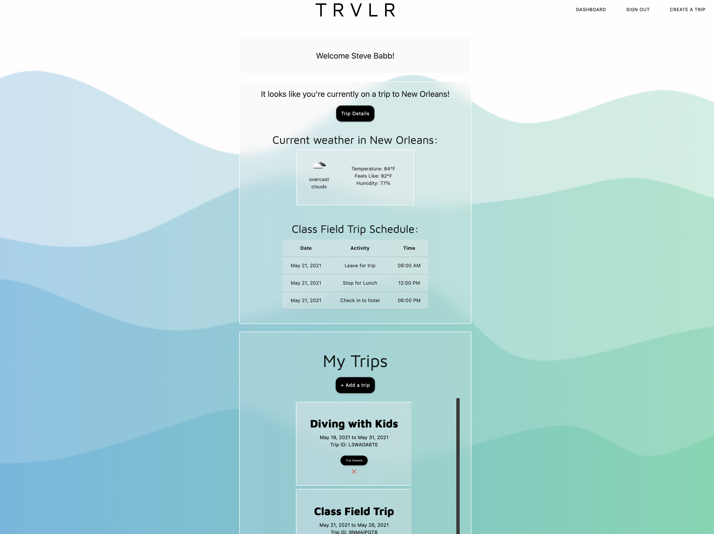
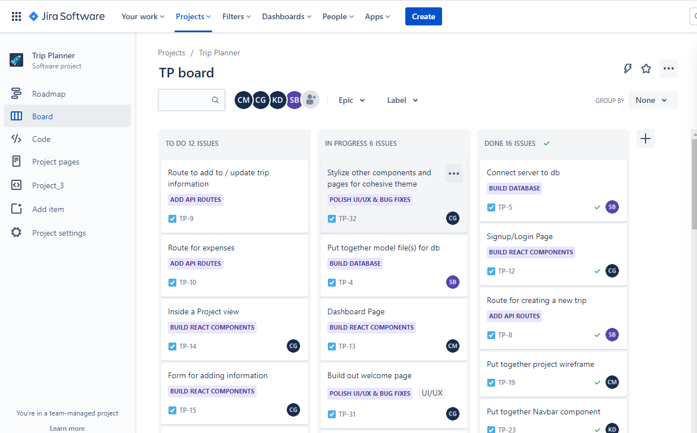

# Trip Planner

[TRVLR Trip Planner](https://trvlr-trip-planner.herokuapp.com/)

An app allows user to collaborate on trip planning and view trip details in a shared work space.

## Problem

When planning a trip with a group, it is challenging to keep everyone on the same page and have easy access to all of the information or to collaborate on ideas/schedules, etc. Email, texting, and using shared calendars are often informally used among the group to plan and ideate and document schedules. Communication threads can get long. Details get lost. No central dashboard for the group to view trip details and plan together.

## Solution

A one-stop-shop web space for sharing and collaborating on all details related to group trips.

## User Story

```
AS A person who likes to plan and take trips with friends and family

I WANT all trip members to access and collaborate on key trip details

AND view/add/delete events to our trip schedule

And share ideas for activities with other members

AND track all of the shared expenses incurred while on a trip

SO THAT I can stay informed and save time
```

## Wireframe

View a wireframe of the app here:

https://www.figma.com/file/qqC9nOXYWFf7DncYYf8cg4/Untitled?node-id=0%3A1

## Screenshot



# Jira

Link to Jira Roadmap

https://project-3-trip-planner.atlassian.net/jira/software/projects/TP/boards/1/roadmap



## Development Team Members

- Steve Babb - MongoDB Database, routes
- Kolton Decker - React Routes, server
- Carly Gouge - Frontend Javascript & UI/UX
- Christina Moss - Components & UI/UX

Roles noted above refer to primary emphasis, but all members contributed to full-stack development.
